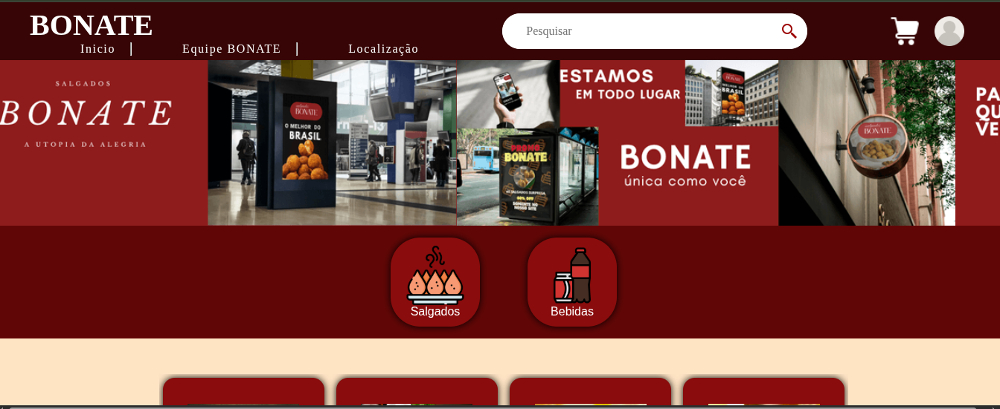
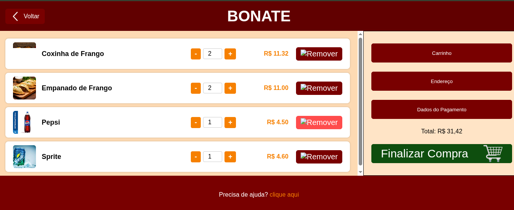
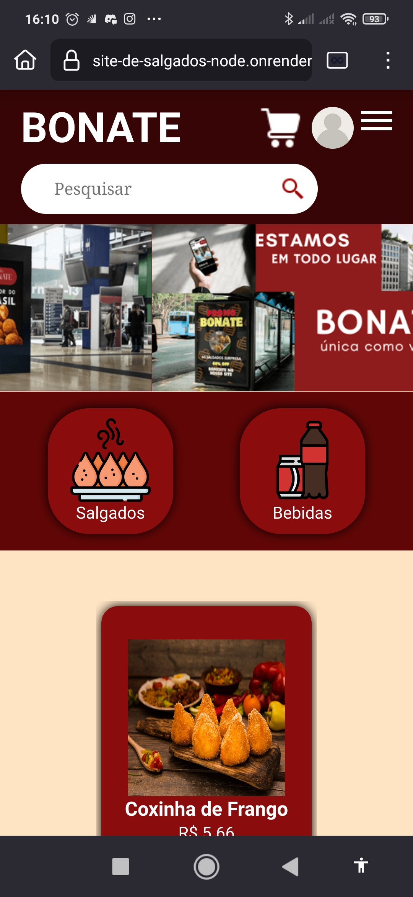
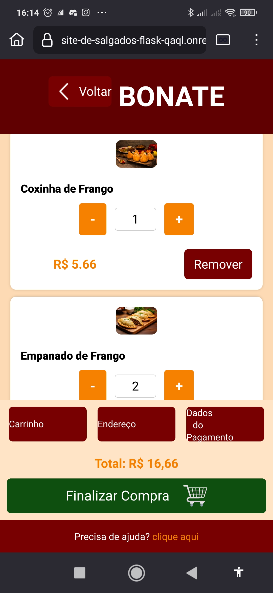
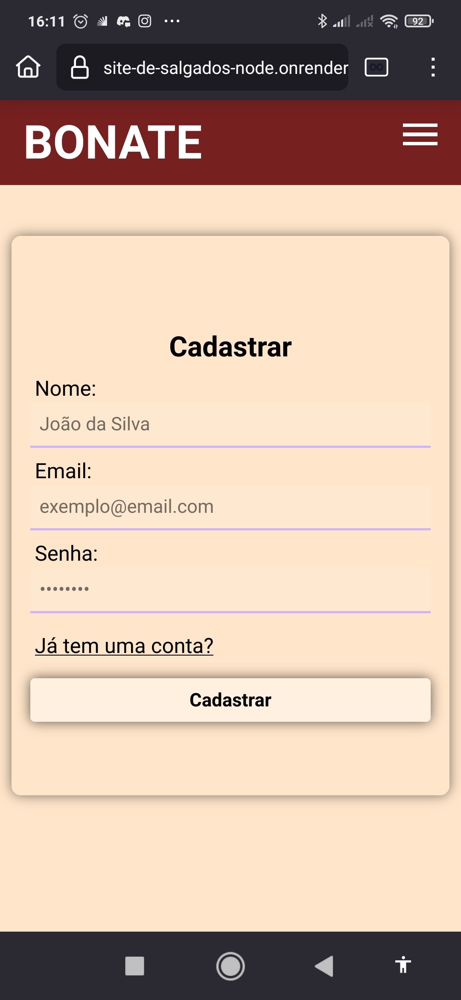
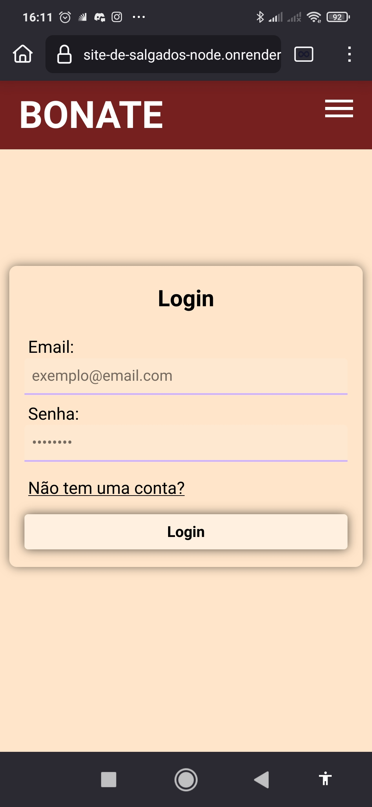
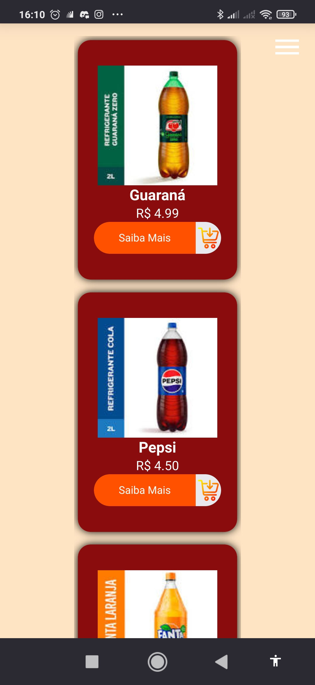
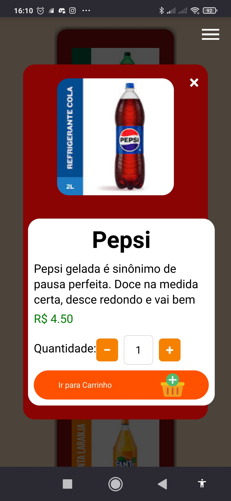
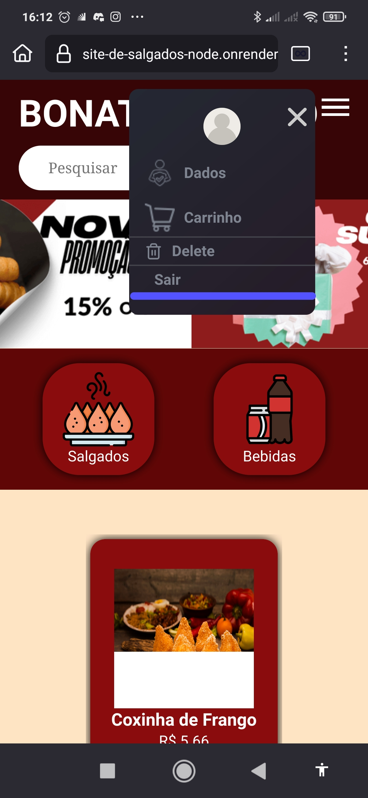

# BONATE

## Sobre o projeto
O Bonate foi criado como atividade do ensino médio técnico, onde o professor propôs que cada aluno desenvolvesse uma loja virtual baseada em algo real. O projeto é uma loja de salgados com carrinho de compras funcional.

Por ser meu primeiro projeto envolvendo tecnologias além do HTML e CSS básico, enfrentei diversos desafios especialmente com o Flask, o que me levou a uma arquitetura híbrida: o Flask cuida apenas da página do carrinho, enquanto o restante do site é gerenciado pelo Node.js com Express.

Durante o desenvolvimento aprendi lições importantes, como a diferença entre localhost e um link público, problemas de caminhos e redirecionamento entre serviços, e como integrar tecnologias diferentes num mesmo projeto.

O design foi criado pela minha colega Ágatha, enquanto eu fiquei responsável por toda a programação. Tenho muito orgulho desse projeto especialmente por funcionar tanto no computador quanto no celular, como você pode ver nas fotos abaixo.

## Tecnologias
- HTML, CSS, JS (Front-end)
- Node.js + Express (Back-end)
- Python + Flask (Carrinho)

---
## Telas no PC

## Telas no Celular

---
## 🚀 Como fazer o Deploy

Este projeto tem 3 partes. Cada uma vai em um serviço diferente:

---

## 1. Back-end Node (Express) → Render

1. Acesse https://render.com e crie uma conta gratuita
2. Clique em "New Web Service"
3. Conecte seu repositório GitHub
4. Configure:
   - **Root Directory:** `Back-end`
   - **Build Command:** `npm install`
   - **Start Command:** `npm start`
5. Após o deploy, copie a URL gerada (ex: `https://site-de-salgados-node.onrender.com`)

---

## 2. Flask (Carrinho) → Render

1. No Render, crie outro "New Web Service"
2. Conecte o mesmo repositório
3. Configure:
   - **Root Directory:** `Flask`
   - **Build Command:** `pip install -r requirements.txt`
   - **Start Command:** `gunicorn app:app`
4. Após o deploy, copie a URL (ex: `https://site-de-salgados-flask.onrender.com`)

---

## ⚠️ Após os deploys, atualize as URLs

Em `Front-end/assets/js/home/produtos.js`, confirme que as URLs batem com as que o Render gerou:
- `API_BASE` → URL do Node
- URL do redirect do carrinho → URL do Flask

